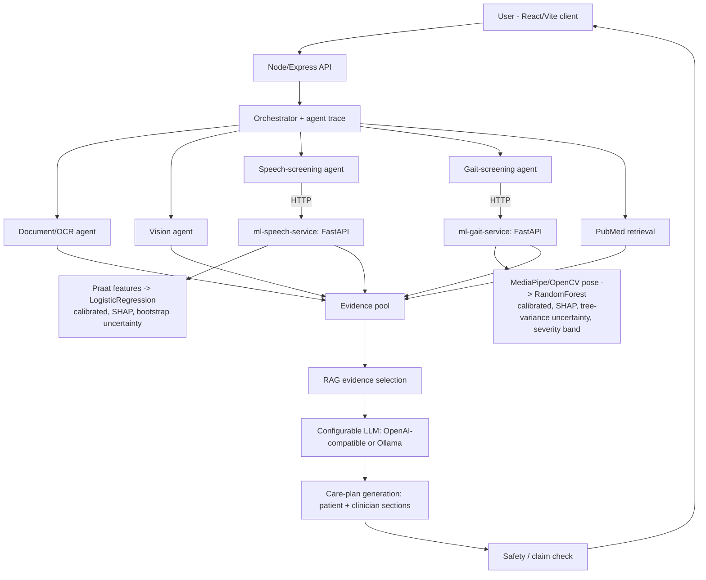

# Parkinson's Multimodal AI Assistant

A multilingual, multimodal, evidence-grounded research prototype for Parkinson's disease screening and information support. The system integrates two independently trained clinical machine learning pipelines, acoustic voice analysis and computer vision-based gait analysis, with a retrieval-grounded conversational assistant within a full-stack TypeScript and Python application.

## Features

### Multimodal Clinical Machine Learning

The system provides two independent screening pipelines, each trained on publicly available clinical datasets and designed to report its limitations explicitly.

* **Speech Analysis:** Uses `parselmouth`, a Praat binding, to extract 22 acoustic biomarkers from each recording. These include jitter and shimmer variants, harmonics-to-noise ratio, and nonlinear dynamical measures such as recurrence period density entropy, detrended fluctuation analysis, correlation dimension, and pitch-period entropy. The feature definitions reproduce those used in the published Parkinson's voice research associated with the source dataset.

* **Gait Analysis:** Implements a computer vision pipeline that converts an ordinary walking video into 12 engineered gait features. These include cadence, step and stride timing statistics, bilateral symmetry, and joint range of motion at the knee, hip, and ankle. Features are computed through peak detection on joint-angle time series.

#### Model Development and Reliability

* **Imbalanced Data Handling:** The speech dataset is substantially imbalanced, containing 147 Parkinson's recordings and 48 control recordings from approximately 31 subjects. Rather than relying on a naive model that produced 87.5% sensitivity but only 33.9% specificity, a systematic model, feature-selection, and threshold-search process was conducted. All comparisons were re-evaluated across 20 randomized subject-grouped fold orderings rather than a single train-test split. The resulting regularized linear model using a small, literature-grounded feature subset generalized better than a tree ensemble using all 22 raw features. ROC-AUC improved from 0.822 to 0.883, while specificity improved from 0.339 to 0.70, with a documented reduction in sensitivity. The complete comparison, including evaluated and rejected configurations, is documented in `ml-speech-service/README.md` and `ml-speech-service/app/experiment_speech.py`.

* **Threshold Optimization:** Classifier operating points are selected using a sensitivity-weighted Youden's J search within nested cross-validation. The threshold-selection fold never overlaps with the evaluation fold. The sensitivity and specificity trade-off is therefore an explicit and configurable product decision through `SENSITIVITY_WEIGHT` in each `train.py`, rather than an implicit `predict() >= 0.5` threshold.

* **Probability Calibration:** ROC-AUC alone does not guarantee that predicted probabilities correspond to meaningful probabilities. The project's calibration analysis identified this issue, with an example where a raw prediction of approximately 12% corresponded to an observed rate of approximately 31%. Isotonic regression is used for gait, which has approximately 4,000 samples, while Platt scaling is used for speech, which has approximately 150 samples and is too small for reliable isotonic calibration. Calibration models are fitted using out-of-fold predictions before scores are presented to users. Before and after Brier scores are reported in each model card.

* **Uncertainty Estimation:** Each screening response includes a `screening_probability_interval`. For gait, this is based on prediction variability across the Random Forest trees. For speech, it is based on subject-level bootstrap ensemble variability. This provides an uncertainty range alongside the point estimate instead of presenting a single confidence value without context.

* **Model-Agnostic Explainability:** Both classifiers provide per-prediction SHAP explanations identifying the measured features that contributed to a result. `TreeExplainer` is used for the Random Forest gait model, while `LinearExplainer` is used for the logistic regression speech model. Both are exposed through a unified interface in `explain.py`, allowing downstream services and the user interface to remain independent of the underlying model family.

* **Ordinal Severity Estimation:** A secondary gait severity estimator is trained only on records containing an actual clinical severity score rather than a derived binary label. It reports a three-level severity band: none, mild, or moderate-to-severe. Performance is evaluated using both exact-match accuracy and within-one-band accuracy to account for the distance between ordinal prediction errors.

* **Clinical Dataset Curation:** The gait model uses six subsets of the multi-site CARE-PD dataset, each of which contains different labeling characteristics. One subset does not provide a diagnostic label in the field that a naive pipeline would expect, requiring an explicit and documented labeling-source decision. Two additional CARE-PD subsets were identified as entirely unlabeled and were excluded rather than assigning inferred labels. Two external gait datasets, consisting of an instrumented force-plate/VGRF dataset and a small expert-rated stride-parameter dataset, were evaluated but not merged into training because their features could not be reproduced by the live inference pipeline. These datasets are instead treated as potential validation resources.

* **Cross-Domain Measurement Gap:** The gait model is trained using motion-capture-grade 3D body parameters but performs inference on ordinary monocular video processed by a real-time pose estimator. Although the same feature categories are used, the underlying measurement methods differ. During development, an arm-swing feature measured approximately 3 to 4 degrees in the training data but approximately 90 degrees during real-time inference, producing a greater than 20x scale mismatch. This discrepancy was identified during development and the feature was excluded from the deployed model rather than introducing a known calibration problem.

### Computer Vision and Time-Series Signal Processing

* Real-time body-landmark estimation using `MediaPipe` and `OpenCV` converts uploaded walking videos into per-frame 3D pose sequences.

* Gait events, including individual steps, are detected using peak finding on knee-flexion angle time series. Cadence, step time, stride time, and their variability are subsequently derived.

* The feature-engineering logic is implemented against two structurally different pose representations: SMPL body-model joint rotations for training data and MediaPipe landmark coordinates for live inference. Both implementations follow a shared interface so that the downstream classifier remains independent of the source representation.

* Numerical differences between the two pose representations are explicitly evaluated rather than assumed to be equivalent.

* Signal-quality gating checks minimum clip duration, minimum detected gait cycles, and minimum pose-detection confidence before generating a score. A real recording containing no visible person was also tested and correctly returned an `"insufficient data"` response rather than producing a fabricated prediction.

### Retrieval-Grounded Language Generation and Multi-Agent Orchestration

* A retrieval-augmented generation pipeline queries PubMed through NCBI E-utilities for each question, ranks and selects relevant passages, and requires the language model to associate factual claims with specific evidence IDs.

* The backend consists of specialized, independently callable agents for speech screening, gait screening, vision analysis, document/OCR processing, and retrieval. These agents are coordinated by an orchestrator that records a step-by-step execution trace. The trace is surfaced in the interface as **"How the assistant worked."**

* A dedicated generation pipeline accepts structured screening outputs, including scores, calibrated confidence, top SHAP-attributed features, and validated model performance figures. It generates two forms of explanation:

  * A plain-language patient-facing summary
  * A technical clinician-facing note containing the measured feature values

* Both explanation formats use the same retrieved evidence and enforce an explicit boundary against diagnostic and prescriptive claims.

* A rule-based post-generation safety check analyzes generated responses for diagnostic-sounding statements and medication directives before the response is delivered to the user. This check operates independently of the language model.

* The language model layer is provider-agnostic. It supports OpenAI-compatible chat-completions APIs and local Ollama models. Providers can be changed through configuration, and the application remains functional without an LLM by displaying the available evidence and screening results rather than silently degrading.

### Clinical and Multilingual NLP

* Full English and Urdu bilingual support is implemented across chat, research mode, and dual-audience care-plan explanations. Right-to-left layout is supported throughout the interface.

* Language selection affects both model instructions and citation handling rather than functioning solely as a user-interface translation layer.

* Prompting is optimized for individual application surfaces. Conversational responses are constrained from unnecessarily adopting report-style formatting, while research and clinician-facing modes permit additional structure when appropriate.

* The vision-analysis pipeline applies the same non-diagnostic language constraints used by the text and screening pipelines. General-purpose vision models are prevented from producing diagnostic-style interpretations of medical images.

### Full-Stack Engineering

* A typed, OpenAPI-first API contract is defined in `lib/api-spec/openapi.yaml`. The specification generates both Express-side Zod validators and React Query client hooks. Changes to backend response structures can therefore be detected by type checking across the network boundary.

* Two Python FastAPI microservices are deployed independently from the Node API layer. Each service has its own pinned dependencies, reproducible training pipeline, automated tests, and versioned model card.

* The React frontend was developed from scratch without a template. It includes a dedicated visual design system, RTL-aware typography, live Markdown rendering, and a screening dashboard displaying calibrated scores, uncertainty intervals, per-feature SHAP contributions, and generated care-plan content.

* Automated tests cover model-serving and orchestration paths. The two ML services contain 13 Python tests that verify, among other requirements, that invalid or inadequate input produces an explicit `"insufficient quality"` response rather than a plausible-looking fabricated score.

* Full-stack TypeScript type checking is applied across the workspace.

## Architecture



The two ML services constitute the technical core of the system and can be trained, tested, and executed independently. The Node.js layer orchestrates these services together with retrieval and language generation but does not compute screening scores itself.

## Repository Layout

```text
artifacts/
├── api-server/                 Express API: orchestration, agents, OpenAPI-driven routes
└── parkinsons-assistant/       React/Vite frontend

ml-speech-service/              FastAPI service: acoustic feature extraction + trained model
ml-gait-service/                FastAPI service: pose extraction + trained model

lib/
├── api-spec/                   OpenAPI source of truth
├── api-zod/                    Generated OpenAPI validators
└── api-client-react/           Generated React Query client

RUN_LOCALLY.md                  Complete local setup and service execution instructions
```

> **Note:** `api-zod/` and `api-client-react/` are generated from the OpenAPI specification and should not be edited manually.

## Local Development

Enable Corepack and install the project dependencies:

```bash
corepack enable
pnpm install
```

Start the Node API:

```bash
pnpm --filter @workspace/api-server run dev
```

Start the React frontend:

```bash
pnpm --filter @workspace/parkinsons-assistant run dev
```

Complete instructions for running all four services, including both Python ML services, the Node API, and the frontend, are provided in `RUN_LOCALLY.md`. The document also describes how to train both models from scratch.

## Testing and Type Checking

Run TypeScript type checking across the workspace:

```bash
pnpm run typecheck
```

Run the speech-service tests:

```bash
cd ml-speech-service/app
pytest test_service.py -v
```

Run the gait-service tests:

```bash
cd ml-gait-service/app
pytest test_service.py -v
```

## Environment Variables

Copy `.env.example` and configure only the providers required for your deployment.

All optional integrations can remain unset. When a provider is unavailable, the system reports an explicit unavailable status rather than crashing or fabricating an output.

### Speech and Gait Screening

These variables configure the core model-backed screening services:

```text
SPEECH_SERVICE_URL
GAIT_SERVICE_URL
SPEECH_SERVICE_TIMEOUT_MS
GAIT_SERVICE_TIMEOUT_MS
SPEECH_WEIGHT
GAIT_WEIGHT
```

* `SPEECH_SERVICE_URL`: URL of the running `ml-speech-service`, for example `http://localhost:8000`.
* `GAIT_SERVICE_URL`: URL of the running `ml-gait-service`, for example `http://localhost:8001`.
* `SPEECH_SERVICE_TIMEOUT_MS` and `GAIT_SERVICE_TIMEOUT_MS`: Request timeouts. Defaults are 20,000 ms and 30,000 ms respectively. CPU-only gait inference on longer clips may require additional time.
* `SPEECH_WEIGHT` and `GAIT_WEIGHT`: Fusion weights used by `POST /api/screen` when both modalities are available. The default is 0.5 and 0.5. These values are not claimed to be clinically optimal.

### Chat and Research LLM Synthesis

For an OpenAI-compatible provider:

```text
LLM_BASE_URL
LLM_MODEL
LLM_API_KEY
```

For a local Ollama model:

```text
OLLAMA_BASE_URL
OLLAMA_MODEL
```

The Ollama configuration does not require an API key.

### Vision Analysis

Vision analysis requires:

```text
VISION_MODEL
```

along with one of the supported provider configurations above. The selected provider must support image inputs through its chat-completions API. Supported configurations may include hosted vision models or local Ollama vision models such as `llava`.

### Other Configuration

```text
SEARCH_API_KEY
CORS_ORIGINS
MAX_UPLOAD_SIZE_MB
VITE_API_URL
```

* `SEARCH_API_KEY`: Optional NCBI API key. It increases the PubMed retrieval rate limit from 3 to 10 requests per second.
* `CORS_ORIGINS`: Configures allowed cross-origin requests.
* `MAX_UPLOAD_SIZE_MB`: Configures the maximum upload size.
* `VITE_API_URL`: Configures the frontend API endpoint.

## API Surface

| Method | Route | Purpose |
| ------ | ----- | ------- |
| `GET` | `/api/healthz` | Service health check |
| `GET` | `/api/capabilities` | Reports which optional providers are configured |
| `POST` | `/api/chat` | Conversational question answering with attachment context |
| `POST` | `/api/research` | Literature-focused retrieval and synthesis |
| `POST` | `/api/analyze/document` | PDF text extraction |
| `POST` | `/api/analyze/image` | Non-diagnostic image description |
| `POST` | `/api/analyze/audio` | Speech screening when `SPEECH_SERVICE_URL` is configured |
| `POST` | `/api/analyze/video` | Gait screening from walking video when `GAIT_SERVICE_URL` is configured |
| `POST` | `/api/screen` | Combined speech and gait screening with fused score and generated care plan |

## Model Summaries

Complete model cards containing dataset composition, cross-validated metrics, calibration curves, and documented limitations are stored in each service's:

```text
app/models/model_card.json
```

These model cards are regenerated whenever `train.py` is executed and are not intended to be edited manually.

### Speech Model

**Model:** Logistic Regression using four selected acoustic features

**Dataset:** Oxford Parkinson's Disease Detection Dataset

**Dataset size:** 195 recordings from approximately 31 subjects

**Performance:**

* ROC-AUC: **0.883**
* Sensitivity: **~0.81**
* Specificity: **~0.41**
* Calibration: **Platt scaling**
* Brier score: **0.149 → 0.128**

The operating point is selected using the project's sensitivity-weighted thresholding procedure.

### Gait Model

**Model:** Random Forest using 12 pose-derived features

**Dataset:** Six subsets of CARE-PD

**Dataset size:** 3,939 walks from 233 subjects

**Performance:**

* ROC-AUC: **0.857**
* Sensitivity: **~0.82**
* Specificity: **~0.65**
* Calibration: **Isotonic regression**
* Brier score: **0.154 → 0.147**
* Secondary severity estimator: **91.5% within-one-band accuracy**


