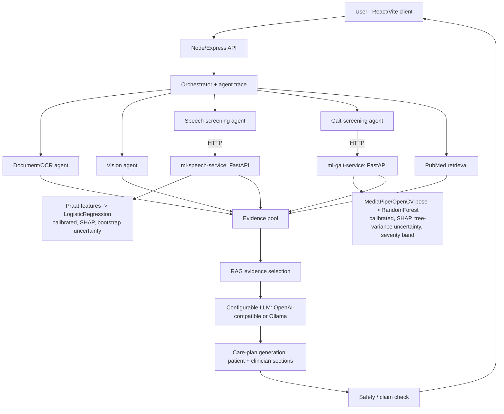

# Parkinson's Multimodal AI Assistant

A multilingual, multimodal, evidence-grounded research prototype for Parkinson's disease screening and information. It fuses two independently trained clinical machine-learning pipelines — acoustic voice analysis and computer-vision gait analysis — with a retrieval-grounded conversational assistant, behind a full-stack TypeScript/Python application.

**This is a research and education prototype, not a diagnostic device.** It does not diagnose, does not prescribe treatment, and does not replace a qualified healthcare professional. Every claim this system makes about its own accuracy is a real, cross-validated number computed from the data on disk — nothing is hard-coded or invented, and every limitation below is enforced in code, not just written down.

---

## What this project actually demonstrates

Rather than a single model behind an API, this is an end-to-end system spanning signal processing, classical ML, computer vision, LLM orchestration, and full-stack engineering — built and iterated with a strict "never fabricate a result" discipline throughout. The sections below describe what was actually built, organized by technical area.

### Multimodal clinical machine learning, with the failure modes usually left out of demos

Two independent screening pipelines, each trained on real public clinical datasets, each honestly reporting its own limitations:

- **Speech**: `parselmouth` (a Praat binding) extracts 22 acoustic biomarkers per recording — jitter and shimmer variants, harmonics-to-noise ratio, and nonlinear dynamical measures (recurrence-period density entropy, detrended fluctuation analysis, correlation dimension, pitch-period entropy) reproduced from the published literature definitions used in the original Parkinson's-voice research this dataset comes from.
- **Gait**: a full computer-vision pipeline (below) turns an ordinary walking video into 12 engineered gait features — cadence, step/stride timing statistics, bilateral symmetry, and joint range-of-motion at the knee, hip, and ankle, computed via peak-detection on joint-angle time series.

On top of these features:

- **Imbalanced-data handling done properly.** The speech dataset is severely imbalanced (147 Parkinson's recordings vs. 48 controls, only ~31 subjects). Instead of accepting the naive result (a model that flags almost everyone as "elevated," 87.5% sensitivity but 33.9% specificity), a systematic model/feature-selection/threshold search — with every comparison re-verified across 20 randomized subject-grouped fold orderings, not a single lucky split — found that a regularized linear model on a small, literature-grounded feature subset generalizes far better than a tree ensemble on all 22 raw features. ROC-AUC improved from 0.822 to 0.883; specificity from 0.339 to 0.70, at a documented sensitivity cost. `ml-speech-service/README.md` and `ml-speech-service/app/experiment_speech.py` show the full comparison, including the configurations that were tried and rejected.
- **Decision thresholds are tuned, not assumed.** Both classifiers select their operating point via a sensitivity-weighted Youden's-J search, computed through *nested* cross-validation (the threshold-selection fold never overlaps the evaluation fold). The sensitivity/specificity trade-off is an explicit, documented, tunable product decision (`SENSITIVITY_WEIGHT` in each `train.py`), not an accident of `predict() >= 0.5`.
- **Probabilities are calibrated, not just ranked.** A model with strong ROC-AUC can still report probabilities that don't mean what they say — this project's own calibration check found exactly that (a raw ~12%-probability prediction corresponded to a ~31% real-world rate). Isotonic regression (gait, ~4,000 samples) and Platt scaling (speech, ~150 samples — isotonic overfits at this size) are fit on out-of-fold predictions and applied before any score reaches the user, with before/after Brier scores reported honestly in each model card.
- **Uncertainty is reported alongside the point estimate.** Every screening response includes a `screening_probability_interval` — tree-prediction spread for the gait RandomForest, subject-level bootstrap-ensemble spread for the speech logistic model — so a wide, low-confidence spread is visible rather than hidden behind a single confident-looking number.
- **Explainability is model-agnostic by construction.** Both classifiers return a live, per-prediction SHAP breakdown of which specific measured features pushed that specific result up or down — `TreeExplainer` for the RandomForest gait model, `LinearExplainer` for the logistic-regression speech model, unified behind one interface (`explain.py`) so the same downstream code and UI work regardless of which model family is behind them.
- **A secondary ordinal-severity estimator**, trained only on the subset of gait data carrying a real clinical severity score (not a derived binary label), reports a none/mild/moderate-to-severe band alongside the binary screening flag — evaluated with both exact-match and within-one-band accuracy, since ordinal problems collapsed into a single "accuracy" number hide how far off the mistakes were.
- **Dataset curation across heterogeneous, imperfectly-labeled real clinical data.** The gait model is trained on six subsets of a multi-site clinical dataset (CARE-PD), each labeled a different way — one subset has no diagnostic label at all in the field a naive pipeline would expect, requiring an explicit, logged, and documented labeling-source decision per subset rather than a silent one-size-fits-all assumption. Two other CARE-PD subsets were identified as entirely unlabeled and explicitly excluded rather than guessed. Two external gait datasets (a force-plate/VGRF instrumented-gait dataset and a small expert-rated stride-parameter dataset) were evaluated and deliberately *not* merged into training once it became clear their features couldn't be reproduced by this project's own live-inference pipeline — documented as a validation opportunity instead of silently forcing an unreliable merge.
- **A known cross-domain gap is disclosed, not hidden.** The gait model trains on motion-capture-grade 3D body parameters but *infers* on ordinary monocular video processed through a real-time pose estimator — two different measurement methods for the same named features. This was confirmed concretely, not just theoretically: an arm-swing feature measured ~3-4° in training data and ~90° from a real inference-time video, a >20x scale mismatch caught during development and used to justify excluding that feature from the deployed model rather than shipping a miscalibrated one.

### Computer vision & time-series signal processing

- Real-time body-landmark estimation (`MediaPipe`/`OpenCV`) turns an uploaded video into a per-frame 3D pose sequence.
- Gait events (individual steps) are detected via peak-finding on the knee-flexion angle time series, from which cadence, step time, stride time, and their variability are derived — the same category of spatiotemporal gait-analysis quantities used in clinical gait labs, computed here from ordinary video instead of instrumented equipment.
- The same feature-engineering logic runs against two structurally different pose representations (SMPL body-model joint rotations for training data, MediaPipe landmark coordinates for live inference), deliberately designed as two implementations of one shared interface so the downstream classifier is agnostic to which pipeline produced its input — while the numerical differences between the two are explicitly tested and disclosed rather than assumed away.
- Signal-quality gating (minimum clip duration, minimum detected gait cycles, minimum pose-detection confidence) prevents a score from ever being produced on unreliable input — verified with a real recording containing no visible person, which correctly returns "insufficient data" rather than a fabricated number.

### Retrieval-grounded language generation and multi-agent orchestration

- A retrieval-augmented generation pipeline queries PubMed live (NCBI E-utilities) for each question, ranks and selects passages, and requires the language model to cite specific evidence IDs for factual claims — answers are structurally prevented from presenting unsourced claims as sourced ones.
- The backend is organized as a small set of specialized, independently callable agents (speech-screening, gait-screening, vision, document/OCR, retrieval) coordinated by an orchestrator that records a step-by-step execution trace — surfaced in the UI as "how the assistant worked" — rather than a single opaque prompt-and-response call.
- A dedicated generation path takes structured screening output (scores, calibrated confidence, top SHAP-attributed features, the model's own validated accuracy figures) and produces a two-audience explanation — a plain-language patient-facing summary and a more technical clinician-facing note referencing the actual measured feature values — grounded in the same retrieved evidence, with an explicit, enforced boundary against diagnostic or prescriptive claims regardless of framing.
- A rule-based post-generation safety check scans every generated answer for diagnostic-sounding or medication-directive language before it reaches the user, independent of whatever the language model itself was asked to avoid.
- The LLM layer is provider-agnostic (any OpenAI-compatible chat-completions API, or a local Ollama model) — swapped via configuration, with the system functioning identically (evidence and screening results still shown) when no LLM is configured at all rather than degrading silently.

### Clinical and multilingual NLP

- Full English/Urdu bilingual support, including right-to-left layout, threaded through every generation surface (chat, research mode, and the dual-audience care-plan explanations above) — not a UI-only translation layer, but a language switch that changes what's asked of the model and how citations are preserved across scripts.
- Prompting is explicitly tuned per surface: conversational answers are constrained against manufacturing report-style structure for simple questions, while research-mode and clinician-facing generation are permitted more structure when the question warrants it — an explicit, tested formatting policy rather than one prompt trying to serve every context.
- A vision-analysis path applies the same non-diagnostic-language constraint to image description that the text and screening paths use — including an explicit refusal to let a general-purpose vision model offer a diagnostic-flavored impression of a medical image, the same "don't let an unvalidated model quietly do a validated model's job" principle applied to the screening pipelines above.

### Full-stack engineering

- A typed, OpenAPI-first contract (`lib/api-spec/openapi.yaml`) generates both the Express-side Zod validators and the React Query client hooks, so a backend response shape change is caught by the type checker at build time on both sides of the network boundary, not discovered at runtime.
- Two Python microservices (FastAPI) are deployed independently of the Node API layer, each with its own dependency-pinned, tested, reproducible training pipeline and versioned model card — the orchestration layer treats them as swappable, independently deployable services rather than in-process model calls.
- A from-scratch React frontend (no template) with a considered visual design system, RTL-aware typography, live markdown rendering of generated content, and a dedicated screening dashboard visualizing calibrated scores, uncertainty bands, per-feature SHAP contribution charts, and the generated care-plan text side by side.
- Every model-serving and orchestration path is covered by an automated test suite (13 Python tests across both ML services, asserting — among other things — that a bad input *always* produces an explicit "insufficient quality" response rather than a plausible-looking fabricated score) plus full-stack TypeScript type-checking across every package in the workspace.

---

## Architecture



The two ML services are the technical core and can be trained, tested, and run entirely on their own (see their READMEs); the Node layer orchestrates them alongside retrieval and generation but never computes a screening score itself.

## Repository layout

```
artifacts/
  api-server/           Express API: orchestration, agents, OpenAPI-driven routes
  parkinsons-assistant/ React/Vite frontend
ml-speech-service/       FastAPI microservice: acoustic feature extraction + trained model
ml-gait-service/          FastAPI microservice: pose extraction + trained model
lib/
  api-spec/              OpenAPI source of truth
  api-zod/, api-client-react/   Generated from the OpenAPI spec (do not hand-edit)
RUN_LOCALLY.md            Full local setup, all four services
```

## Local development

```bash
corepack enable
pnpm install
pnpm --filter @workspace/api-server run dev
pnpm --filter @workspace/parkinsons-assistant run dev
```

Full instructions for running all four services (both Python ML services plus the Node API and frontend) together, including how to train each model from scratch, are in [`RUN_LOCALLY.md`](./RUN_LOCALLY.md).

Type/test checks:

```bash
pnpm run typecheck                                             # whole workspace
cd ml-speech-service/app && pytest test_service.py -v
cd ml-gait-service/app && pytest test_service.py -v
```

## Environment variables

Copy `.env.example` and configure only the providers you want to enable. Everything is optional — unset pieces show an explicit "unavailable" status rather than crashing or fabricating output.

**Speech & gait screening** (the core, model-backed features):
- `SPEECH_SERVICE_URL` — URL of a running `ml-speech-service` (e.g. `http://localhost:8000`).
- `GAIT_SERVICE_URL` — URL of a running `ml-gait-service` (e.g. `http://localhost:8001`).
- `SPEECH_SERVICE_TIMEOUT_MS` / `GAIT_SERVICE_TIMEOUT_MS` — request timeouts (default 20000 / 30000; gait CPU-only pose inference on longer clips may need more).
- `SPEECH_WEIGHT` / `GAIT_WEIGHT` — fusion weights used by `POST /api/screen` when both modalities succeed (default 0.5 / 0.5, not claimed clinically optimal).

**Chat / research LLM synthesis** (optional):
- `LLM_BASE_URL` + `LLM_MODEL` + `LLM_API_KEY` for any OpenAI-compatible provider.
- Or `OLLAMA_BASE_URL` + `OLLAMA_MODEL` for a local Ollama model — no API key needed.

**Vision (image attachment) analysis** (optional):
- `VISION_MODEL`, plus one of the two provider configs above. The provider must accept image input in its chat-completions API (e.g. a hosted vision model, or a local Ollama vision model such as `llava`).

**Other:**
- `SEARCH_API_KEY` — optional free NCBI key, raises the PubMed retrieval rate limit from 3 to 10 req/s.
- `CORS_ORIGINS`, `MAX_UPLOAD_SIZE_MB`, `VITE_API_URL` — standard deployment configuration.

## API surface

| Method | Route | Purpose |
| --- | --- | --- |
| GET | `/api/healthz` | Service health |
| GET | `/api/capabilities` | Which optional providers are actually configured |
| POST | `/api/chat` | Conversational Q&A with attachment context |
| POST | `/api/research` | Literature-focused retrieval and synthesis |
| POST | `/api/analyze/document` | PDF text extraction |
| POST | `/api/analyze/image` | Non-diagnostic image description |
| POST | `/api/analyze/audio` | Speech screening (real score when `SPEECH_SERVICE_URL` is set) |
| POST | `/api/analyze/video` | Gait screening from a walking video (real score when `GAIT_SERVICE_URL` is set) |
| POST | `/api/screen` | Combined speech + gait screening with fused score and generated care plan |

## Model summaries

Full model cards (dataset composition, exact cross-validated metrics, calibration curves, and every documented limitation) live in each service's `app/models/model_card.json`, regenerated every time `train.py` runs — never edited by hand.

**Speech** — LogisticRegression on 4 selected acoustic features, Oxford Parkinson's Disease Detection Dataset (195 recordings, ~31 subjects): ROC-AUC 0.883, sensitivity-weighted operating point (sensitivity ~0.81, specificity ~0.41), Platt-calibrated (Brier 0.149 → 0.128).

**Gait** — RandomForest on 12 pose-derived features, 6 subsets of CARE-PD (3,939 walks, 233 subjects): ROC-AUC 0.857, sensitivity-weighted operating point (sensitivity ~0.82, specificity ~0.65), isotonic-calibrated (Brier 0.154 → 0.147), plus a secondary 3-band severity estimator (91.5% within-one-band accuracy).

Neither model has been externally validated on a prospectively collected, independent population — both are explicitly research prototypes, and every response they produce says so.

## Safety and privacy

Uploaded files are held in memory for the request only and are not persisted or logged. Every generated answer is scanned for diagnostic-sounding or medication-directive language before reaching the user, independent of what the underlying language model was instructed to avoid. Screening outputs are model scores, never disease probabilities framed as certainty.

## Deployment

The frontend is a static Vite build suitable for any static host. The Node API and both Python services deploy independently (see each service's `DEPLOY.md`) — none of the three requires the others to be co-located, only reachable over HTTP.
